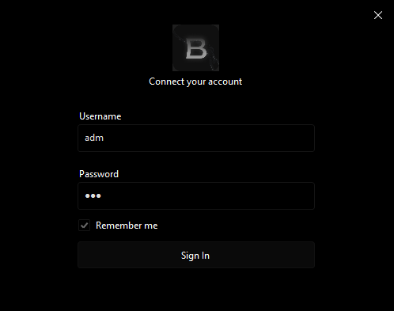

# Example Game/Application Launcher (C# WinForms)

A **C# WinForms application** demonstrating a simple **game/application launcher** with a simulated authentication system and an integrated overlay. This project is intended for **educational purposes** to show how to create launchers, handle example login workflows, and overlay UI integration.

---

## Features

- **Launcher interface** built with C# WinForms  
- Simulated authentication system for demonstration  
- Launches a specified application with example logic  
- Integrated overlay system (can be expanded with ImGui or custom UI)  
- Clean, modular design for learning and extension  

---

## Screenshots / Preview



*Above: Example of the launcher with simulated authentication and overlay.*

---

## Getting Started

### Requirements
- .NET Framework / .NET Core compatible with your setup  
- Visual Studio 2019 or newer  

### Build Instructions
1. Clone this repository:

```bash
git clone [https://github.com/yourusername/your-repo](https://github.com/matheusc9/Loader-CS).git
